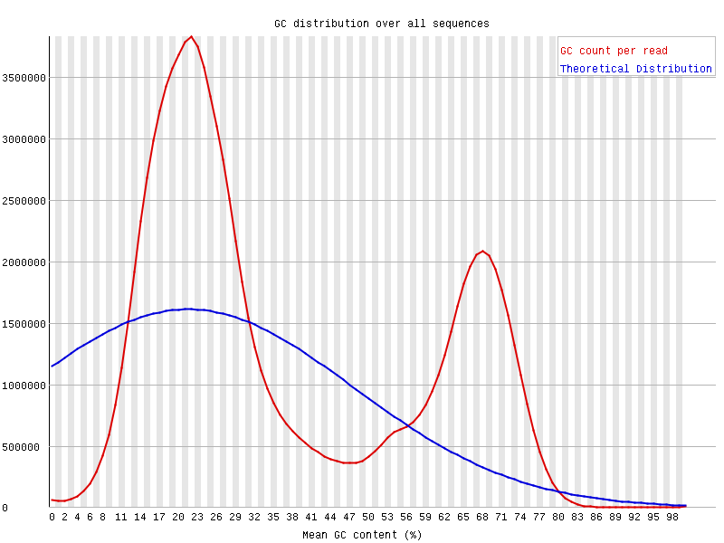
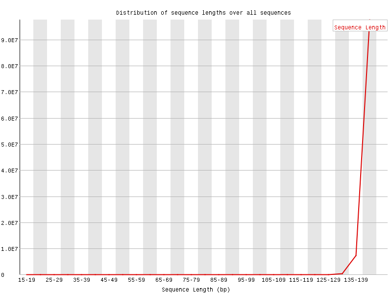
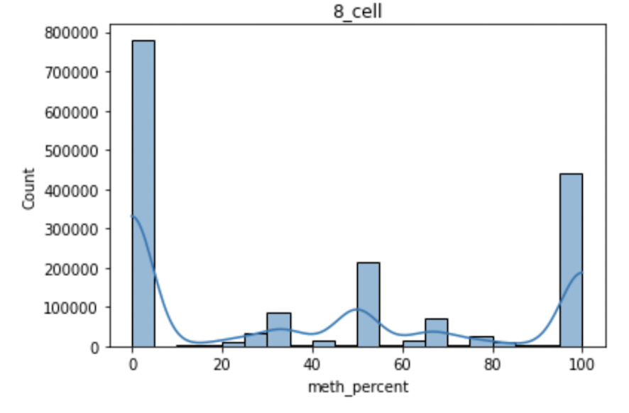
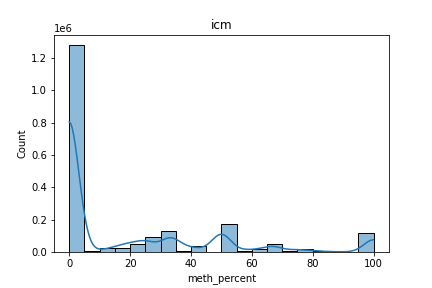
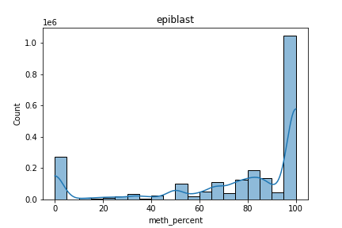
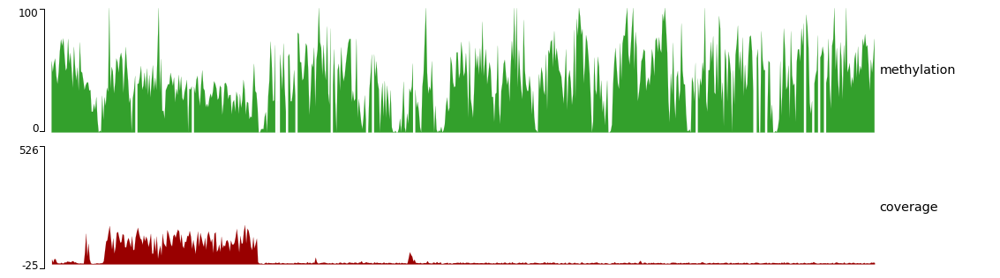
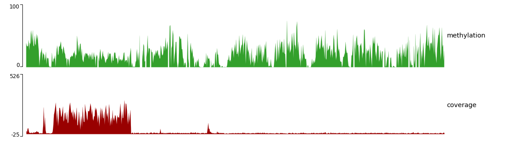
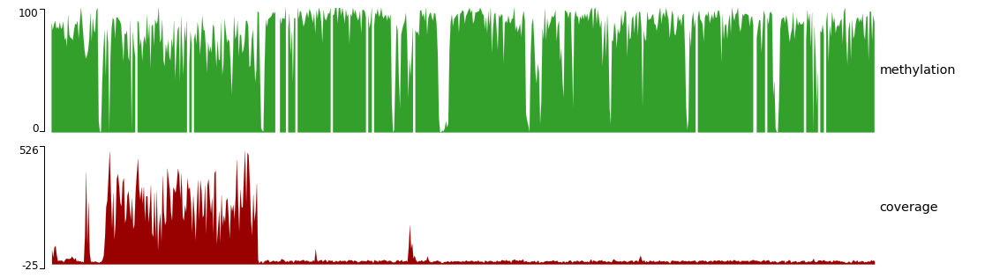

# hse_hw1_meth
Изучение глобального изменения уровня CpG метилирования ДНК при раннем эмбриональном развитии мыши
## [Google Colab link](https://colab.research.google.com/drive/1lTmqBHPXeiX-GZQMxfl7XUzR-kQB5bwS?usp=sharing)
## 1. Особенности бисульфитного секвенирования
### Per base sequence content

В ДНК\РНК секвенировании в соответствии со вторым правилом Чаргаффа мы получаем риды, в которых в среднем содержание аденинов совпадает с содержанием тиминов, а содержание цитозинов - с содержанием гуанинов. В бисульфитном секвенировании большая часть цитозинов превращается в тимины, в результате чего мы наблюдаем на графике сильно заниженное содержание цитозинов и сильно завышенное содержание тиминов.
### Per sequence GC content

В ДНК\РНК секвенировании несмещенного образца распределение GC содержания в ридах должно быть близким к нормальному распределению, построенному на основе GC содержания в исследуемых данных. В бисульфитном секвенировании из-за превращения метилированных цитозинов в тимины мы можем получить распределение сильно отличающиеся от нормального.
### Sequence Length Distribution

В отчете о качестве в разделе, посвященном распределению длины ридов, отображается предупреждение, поскольку было обнаружено заметное количество последовательностей разной длины. Возможно, это тоже особенность бисульфитного секвенирования, а может быть лишь особенность рассматриваемых данных.
## 2.
### a) Число ридов, закартированных на интересующие участки
Cell type | Reads mapped at 11347700-11367700 | Reads mapped at 40185800-40195800 |
 --- |--- |---
8 cell | 1090 | 464
ICM | 1456 | 630
Epiblast | 2328 | 1062
### b) Сколько процентов прочтений дуплицированно в каждом из образцов?
Cell type | Duplication % |
 --- |---
8 cell | 18.31
ICM | 9.08
Epiblast | 2.92
### e) Гистограммы распределения метилирования цитозинов по хромосоме
#### 8 cell

#### ICM

#### Epiblast

#### Выводы
Судя по гистограммам:
* На этапе 8 клеток около половины исследуемых участков на 11-ой хромосоме не метилированы. В оставшейся половине участков процент метилирования разнится: заметно больше полностью заметилированных участков, но также немало участков имеют около 50% метилирования. В целом уровень метилирования средний.
* На этапе ICM подавляющее большинство участков неметилировано - произошёл резкий спад.
* На этапе эпибласта большая часть участков заметилировалась.

В целом, наблюдаемая тенденция соответствует результатам из статьи. Однако, есть одно отличие. Судя по гистограммам, на стадии эпибласта метилирование намного сильнее, чем на стадии 8 клеток, в то время как на рисунке из статьи эти стадии должны находиться примерно на одном уровне метилирования.
### f) Визуализиция уровня метилирования и покрытия для каждого образца
#### 8 cell

#### ICM

#### Epiblast

#### Выводы
Представленная выше визуализация воспроизводит результаты, полученные при построении гистограмм: метилирование на стадии 8 клеток заметное, затем на ICM этапе оно сильно снижается, после чего на стадии эпибласта достигает максимальных значений.
